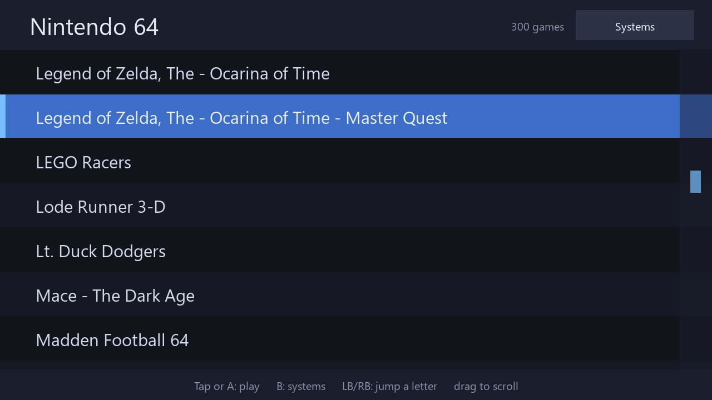
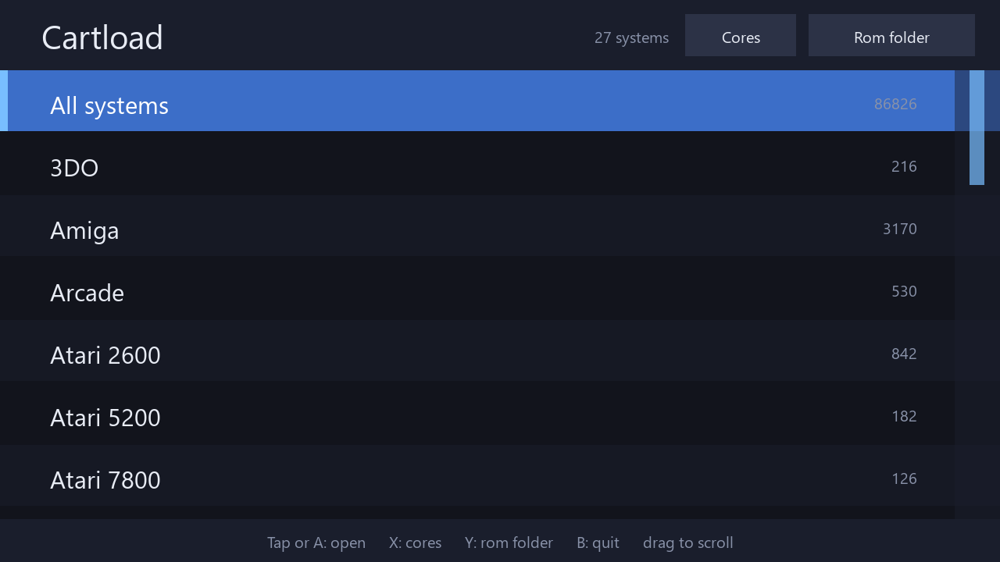
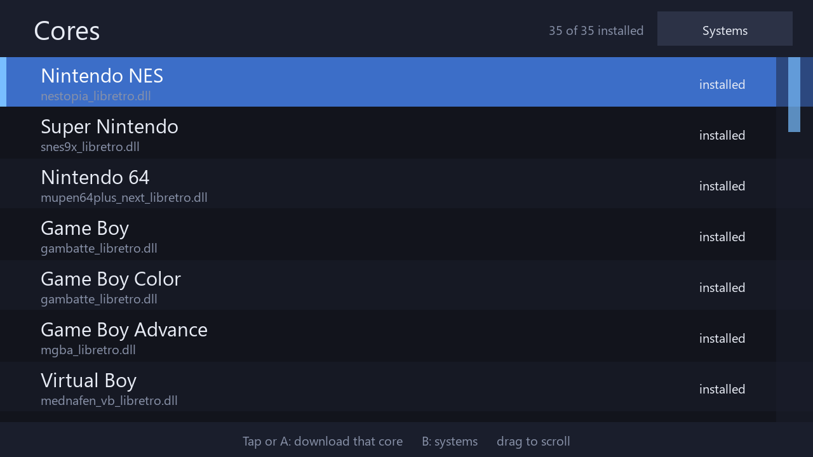
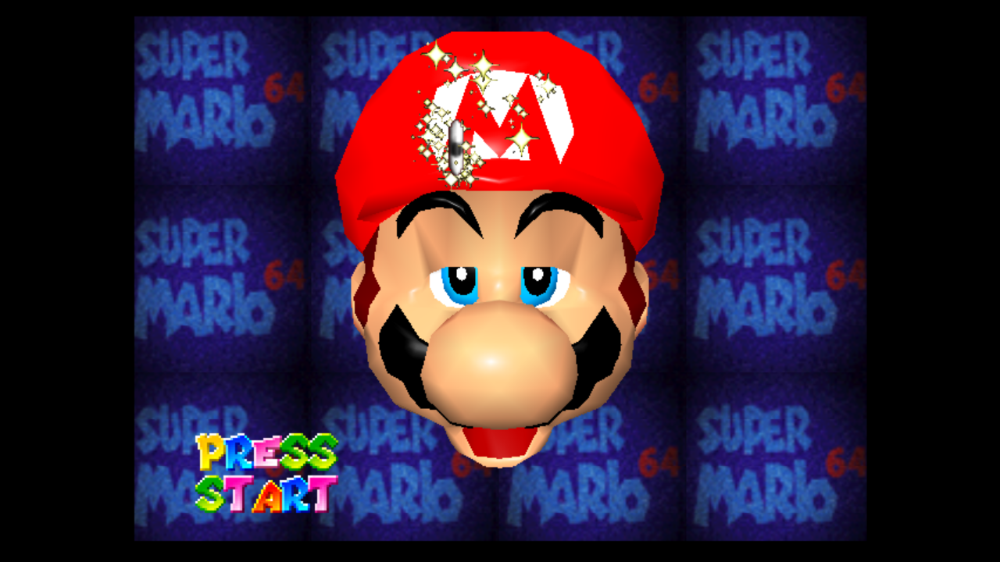
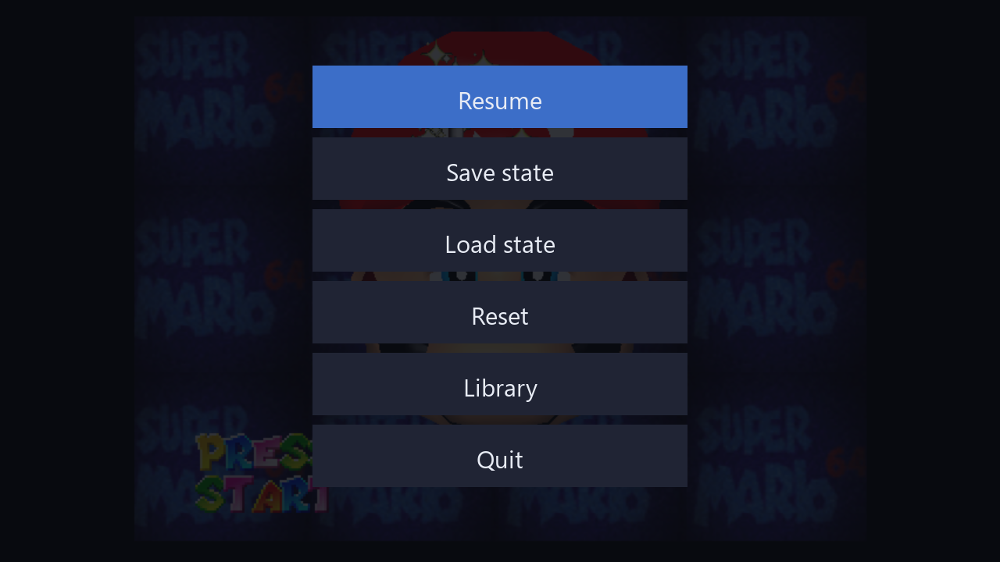

# Cartload

**One app, a cartload of machines.** Pick a system, pick a game, play — on a 7"
touchscreen, with a gamepad, without ever seeing a file manager or a config dialog.

*The library: big touch rows, drag to scroll with momentum, tap to play. The stick and
d-pad work too, and the shoulder buttons jump a letter at a time.*

Cartload is a touch + gamepad frontend for a shelf of libretro cores, built for Windows
handhelds (an ONEXPLAYER: 1920x1200 7" screen, Ryzen 6800U). It emulates nothing itself.
Every machine is somebody else's emulator, loaded as a libretro core the moment you pick a
game — the way MAME/MESS puts many machines behind one program, except each machine here
gets the core that is best at it.

It descends from [SnesDeck](https://github.com/sp00nznet/snesdeck) and
[N64Deck](https://github.com/sp00nznet/n64deck), which were this same frontend with one
system each.

- **86,000 roms across 27 machines scan in about four seconds** over SMB, and the list
  scrolls at 60fps with momentum.
- **The folder decides the machine, not the extension** — half a real collection is `.zip`
  and `.7z`, which name nothing. A library organised one-directory-per-system just works.
- **Cores install themselves.** Missing an emulator? Tap it.
- **Saves never go back to the share.** Cartridge saves and states are written locally, so
  a dropped wifi connection mid-game cannot corrupt them.
- **One 2.8MB exe.** No installer, no redist, no SDL DLLs, no Python, no web view.

## The screens

**Systems** — what your library actually contains, with a count each. Not a menu of
everything Cartload could run.

**Cores** — every machine, the core that runs it, and whether it is installed. Tap a row
to download it from the libretro buildbot; the row counts the seconds, so a 250MB MAME
core doesn't look like a hang.

**Game** — the pad mapped to that machine's controller, the frame at the aspect the core
asks for. Single tap opens the menu, double tap toggles fullscreen.

**In-game menu** — resume, save state, load state, reset, back to the library. Big enough
to hit with a thumb while the game waits underneath.

## Quick start

1. [Build it](docs/build.md), or copy a built folder to the handheld — keep `cores\` next
   to `cartload.exe`.
2. Install 7-Zip, or drop `7za.exe` beside the exe. Most roms arrive packed; without it,
   only loose files load.
3. Run `cartload.exe`. It starts fullscreen on the systems screen.
4. Tap **Rom folder** and point it at your library — a mapped drive or a UNC path both
   work. It remembers.
5. Tap **Cores** and grab whatever is missing.

## What actually runs

Thirteen machines are confirmed working with a **frame that was looked at**, not just an
exit code: SNES, NES, N64, Genesis, Master System, Game Gear, Game Boy, GBA,
TurboGrafx-16, Commodore 64, Atari 2600, WonderSwan and MAME. Another dozen are wired up
and waiting on a BIOS or a first test.

The honest, per-system version of that — including what is broken and why — is in
[docs/systems.md](docs/systems.md).

## Controls

| | Gamepad | Touch |
| --- | --- | --- |
| Open / play | A | tap |
| Back a screen | B | the header button |
| Jump a letter | LB / RB | drag the right edge |
| Cores screen | X | tap **Cores** |
| Rom folder | Y | tap **Rom folder** |
| In-game menu | left stick click | single tap |
| Fullscreen | — | double tap |

Keyboard equivalents and the full libretro mapping are in [docs/usage.md](docs/usage.md).

## Docs

- [Using Cartload](docs/usage.md) — rom library, cores, archives, saves, full controls
- [What runs](docs/systems.md) — verified systems, what's broken, how a rom finds its machine
- [Building](docs/build.md) — cmake, the single-exe build, and the selftest

## License

MIT — see [LICENSE](LICENSE). The cores are not part of this project; each is under its
own license and is downloaded from the libretro buildbot at your request. Bring your own
roms.
